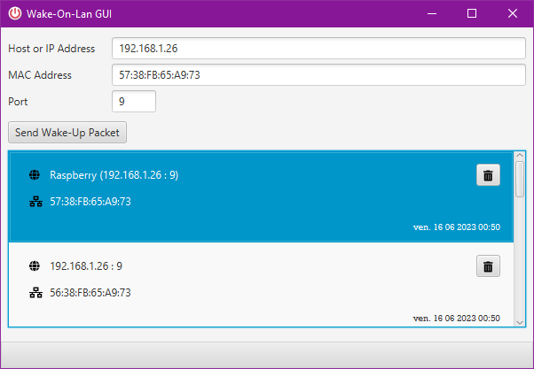
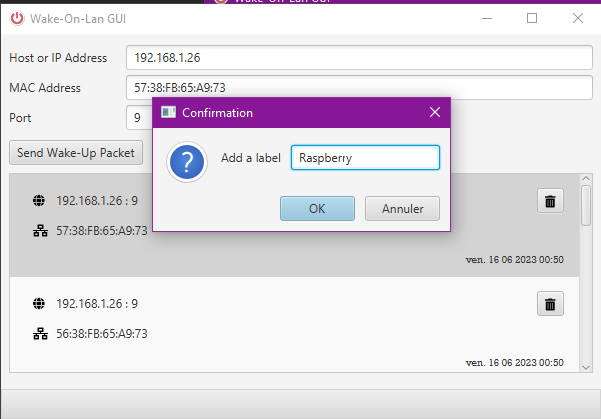

# Wake-On-Lan

## Description
I created this project because there was a lack of working tool allowing me to send a magick packet to my computer in order to wake it. There was some online tools who were working but stopped, some were there are tons of annoying ads. And my favorite just disappeared.
So there was a need, I fixed it. It's not online, because I don't want to pay for the hosting. The source code is there, you can compile it easily.

<!-- BADGIE TIME -->

<!-- END BADGIE TIME -->

## Visuals

## Installation
I will provide a zip and an installer in the future

## Usage
- Type the host or ip address of your machine. If you have NAT and behind a router type the host or external ip visible for the router.
- Type the MAC address of the machine that you want to wake-up. 
- Wake-On-Lan must be enabled for the machine. If you have a router, allow it to redirect the wake-on-lan packet.
I don't provide documentation nor help on how to do it. You'll have to invoke your Google-Fu.
- By default, the Wake-On-Lan magick packet (a special UDP/IP packet) is sent to the port 9. But you can change the port if you have configured another port.

## Support
If you have an issue you can create a ticket on the issue board of the project : [Issues](https://gitlab.com/kowlown/wakeonlan/-/issues)

## Roadmap
I consider the project as complete since it is doing its job. Thus, I have no Roadmap. If you have an idea, you can create an issue, and we may discuss it.

## Project status

